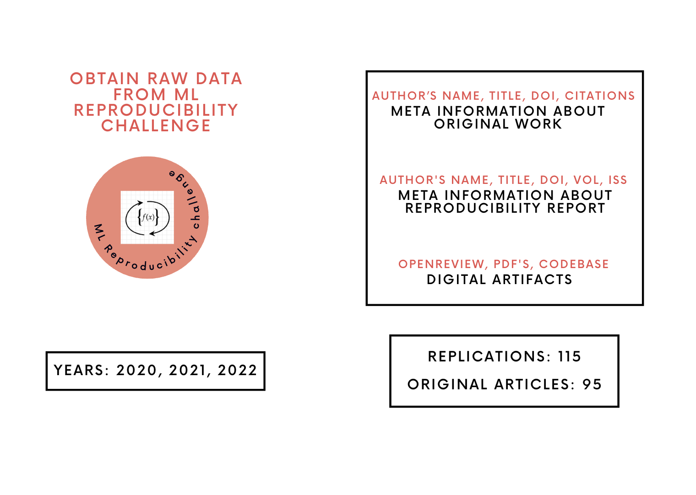

# LLMSciSci
Experiments, and how-to guide for the lecture "Large language models for Scientometrics"


>(Credit: Davide Bonazzi) from [*Discover Magazine*](https://www.discovermagazine.com/the-sciences/the-science-of-science)

### About
**Large Language Models:**

The capabilities of Large Language Models (**LLM's**) to process data from different modalities and excel at different tasks ranging from information extraction, question and answering, math, coding, and recently reasoning simply shows the potential of this technology. Intuitively the complexities of training these models on different datasets/data mixes, opting different architectural choices, choosing different alignment strategies **[1]** seemingly could suggest picking a specific model for each task, but **LLM's** are geared towards being considered as general task solvers.

### Dataset
```plaintext
TBA
```


### Session-1:
For this hands-on session we are going to test out three use-cases, **Labelling**, **Information Extraction**, and **LLM as a Judge**. We are going to use the dataset from the paper <u>Laying Foundations to Quantify the "Effort of Reproducibility"</u> **[2]**. The dataset and the tasks outline a good experimentation framework to effectively utilize Large language models for computational social science tasks **[3]**.

### Session-2:
```plaintext
TBA
```

### Session-3:
For this hands-on session we are going to use the Reproducibility dataset from the paper <u>Laying Foundations to Quantify the "Effort of Reproducibility"</u> **[2]** to preference tune answers using the **Direct Preference Optimization(DPO)** algorithm. *DPO* unlike other reinforcement algorithms directly applies maximum likelihood on the preference dataset to perform implicit reward modeling. Ideally, similar to most RL algorithms we would be applying the same reward maximization via **KL** divergence constraint. Theoretically, *DPO* is RL free, and doing a simple classification on a given a dataset $D$ that includes **chosen** and **rejected** responses. Learn more about *DPO* from the original paper **[4]**.

$$
L_{DPO}(\pi_{LLMSciSci}: \pi_{LLM-instruct})
\;=\; - \,\mathbb{E}{\bigl(x,\,r^+,\,r^-\bigr) \sim D_{ReproEffortDataset}}
\Bigl[
\log \,\sigma\!\Bigl(
r_\theta(x,r^+) \;-\; r_\theta(x,r^-)
\Bigr)
\Bigr]
$$

$$
r_\theta(x, r)
\;=\;
\beta \,\log \frac{\pi_{LLMSciSci}(r \,\vert\, x)}{\pi_{LLM-instruct}(r \,\vert\, x)}
$$

where the $r_{\theta}$ is computed
- using $r^+$(human preferred response), and $r^-$(rejected responses).
- for the models $\pi_{LLMSciSci}$ and $\pi_{LLM-instruct}$.
- $r_{\theta}$  captures the log-probability of the *chosen* vs *rejected* responses on $D_{ReproEffortDataset}$.
- $\pi_{LLM-instruct}$ is the instruct-tuned open weight reference model.
- $\pi_{LLMSciSci}$ is the final RL model intended to be preference-tuned on $D_{ReproEffortDataset}$.

DPO Notebook: [](https://colab.research.google.com/github/akhilpandey95/LLMSciSci/blob/main/notebooks/LLMs_SciSci_DPO.ipynb)

### References(s):
**[1]** [A Survey of Large Language Models](https://arxiv.org/abs/2303.18223)
<br>
**[2]** [Laying Foundations to Quantify the “Effort of Reproducibility”](https://ieeexplore.ieee.org/abstract/document/10266070)
<br>
**[3]** [Can Large Language Models Transform Computational Social Science?](https://aclanthology.org/2024.cl-1.8/)
<br>
**[4]** [Direct Preference Optimization: Your Language Model is Secretly a Reward Model](https://arxiv.org/pdf/2305.18290)

### Authors and Contributors:
[Akhil Pandey](https://github.com/akhilpandey95), Want to contribute see your name here :), [Open an Issue](https://github.com/akhilpandey95/LLMSciSci/issues/new) ?

### Acknowledgement
The computing resources for this work is supported completely by the Google Cloud Research Credits Grant **331845891**.
